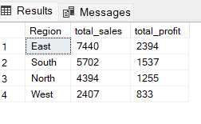
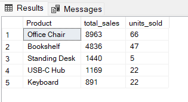
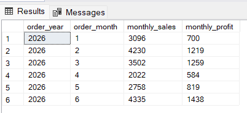
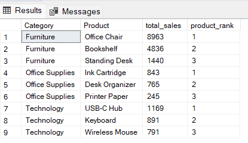

# SQL Sales and Operations Analysis

## Project Overview

This project uses SQL to analyze a fictional sales and operations dataset containing 60 customer orders.

The analysis evaluates sales performance, profitability, product performance, regional trends, customer activity, returns, and shipping efficiency.

## Business Questions

- Which regions generate the most sales and profit?
- Which product categories perform best?
- Which products generate the highest sales?
- Which customers place repeat orders?
- How do sales change by month?
- What is the average shipping time?
- How do returned orders affect profitability?

## Dataset

The dataset contains fictional and anonymized order-level information, including:

- Order dates
- Shipping dates
- Customers
- Regions
- Product categories
- Products
- Quantity
- Sales
- Cost
- Profit
- Returns
- Sales representatives

The dataset was created for portfolio practice and contains no confidential information.

## Tools Used

- SQL Server
- SQL Server Management Studio
- CSV
- GitHub

## SQL Skills Demonstrated

- SELECT
- WHERE
- GROUP BY
- Aggregate functions
- CASE expressions
- Common table expressions
- Window functions
- ROW_NUMBER
- RANK
- LAG
- Running totals

## Repository Structure

```text
data/
sql/
images/
README.md
```
## Regional Performance



This query summarizes total sales and profit by region to identify the highest-performing regions.

## Top Products

This analysis identifies the products generating the highest sales revenue.


## Monthly Sales Trend

This query analyzes monthly sales performance to identify trends over time.

## Product Ranking

Products are ranked within each category using the SQL `RANK()` window function.

## Key Findings

- Furniture generated the highest total sales among all product categories.
- Office Chair ranked as the highest-selling Furniture product.
- USB-C Hub ranked first in the Technology category.
- Ink Cartridge ranked first in the Office Supplies category.
- SQL aggregation and window functions provided insights into sales performance and product rankings.

## Conclusion

This project demonstrates practical SQL skills for analyzing sales and operations data. The analysis uses aggregate functions, common table expressions (CTEs), and window functions to answer business questions and generate actionable insights.

## Author
**Bihonegn Aynalem**
M.S. Analytics Candidate
Georgia Institute of Technology
